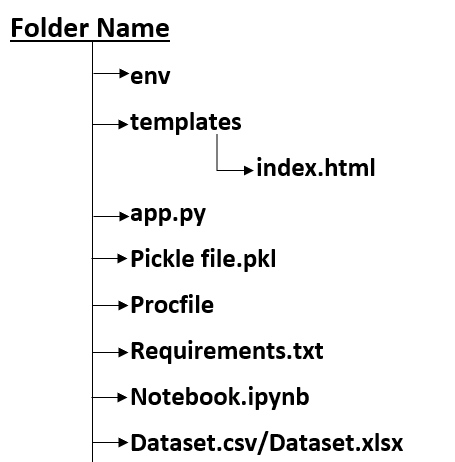
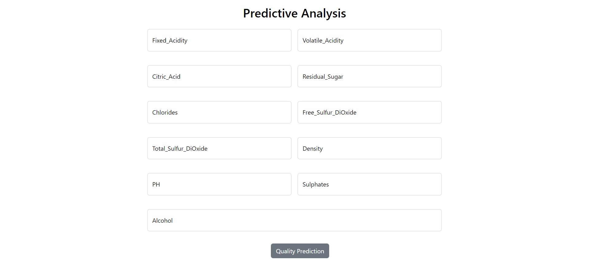
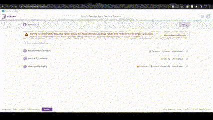
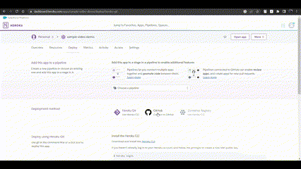

# **End - To - End Machine Learning Model Deployment Using Wine-Quality**

<br>

---

## **Software And Tools Requirements :**

---

<br>

1. [Dataset](https://archive.ics.uci.edu/ml/datasets/Wine+Quality "Wine-Quality")
2. [Github Account](https://github.com "User-Git-Account")
3. [Heroku Account](https://id.heroku.com/login "Heroku-Login")
4. [VS Code IDE](https://code.visualstudio.com/ "Editor")
5. [Git CLI](https://git-scm.com/book/en/v2/Getting-Started-The-Command-Line "Git Setup")

<br>

---

## **File Structure :**

---

<br>


<br>

---

## **Environment Setup :**

---

<br>

> Create a new environment so that whatever coding or whatever end-to-end projects we are actually creating we'll do it entirely in that specific environment

```python
conda create -p env python==3.10 -y
```

> Install the require library by using this cmd .
> This **"requirements.txt"** contains library names which makes easier to install all the library to do the project

```python
pip install -r requirements.txt
```

<br>

---

## **Model Building :**

---

<br>

### **Step - 1 :** Import Required Libraries

> Import basic libraries(pandas, numpy, matplotlib, seaborn) and import model building library(train_test_split, randomforestclassifier and metrics)

```python
import pandas as pd
import numpy as np
import matplotlib.pyplot as plt
import seaborn as sns

from sklearn.model_selection import train_test_split
from sklearn.ensemble import RandomForestClassifier
from sklearn.metrics import accuracy_score, confusion_matrix, ConfusionMatrixDisplay, precision_score, recall_score

sns.set_theme(style="darkgrid")
%matplotlib inline
```

### **Step - 2 :** Import Dataset

> Using pandas read the wine quality CSV file

```python
data = pd.read_csv(r"CSV file destination path", delimiter=";")
```

### **Step - 3 :** Descriptive Analysis

> Done Descriptive analysis to understand data using default function and we tried to find missing values, duplicated values and tried to remove it

```python
data.head() # To get 1st 5 observation of the data
data.describe() # To get the statistical values(central value, std dev, percentage, range)
data.isnull().sum() # To get the sum of null values of eash features
data['quality'].value_counts() # To get the values of each category in target variable
data.info() # To find dimensions and datatypes of the data
data.duplicated().sum() # To find Duplicate observations of the data
data.drop_duplicates(keep='first', inplace=True) # removes the duplicate data from the features
```

### **Step - 4 :** Data Visualisation

> Done various plot to get deep Analysis of the data & find the correlation between features in the data

### **Step - 5 :** Random Forest Model

#### Step - 5.1: split the data into predictor and response variable

#### Step - 5.2: split the X & Y variable into train and test data in 80:20 ratio

#### Step - 5.3: Fit and train the model using randomforestclassifier algorithm

#### Step - 5.4: predict and get accuracy using accuracy function

<br>

---

## **Pickle File :**

---

<br>

### **Step - 1 :** Create Pickle File

> Once model is trained and tested model into the production-ready environment, the first step is to save it into a .pkl file using a library like pickle.

```python
import pickle

file = open('pickle file name', 'wb')

pickle.dump(modelfunction, file)
```

### **Step - 2 :** Load Pickle File

> Let’s load the model from the file

```python
pickle.load(open('pickle file', 'rb'))
```

<br>

---

## **Design Front-End file :**

---

<br>

- Create a new file index.html in a templates folder.

- Use [Bootstrap CDN Link](https://getbootstrap.com/docs/5.2/getting-started/introduction/#cdn-links) to make default template design in HTML

- Inside the body tag create a container and create a bootstrap form template.

- In form action give "{{url_for('route_name')}}" and the method is "http methods".

- Get input from client using input tag for the predictor variable in our model.

- The data from client is tested using the pickle file of our trained data.

- Create a Button for predicting "Quality" by the given data in the form and the prediction result is shown in div tag below the form.

<br>


<br>

---

## **Create App.py :**

---

<br>

> Import the require libraries

```python
import pickle
import numpy as np
from flask import Flask, request, jsonify, render_template
```

> Create Flask & named it as "app" , Load the pickle file to "model" variable

```python
app = Flask(__name__)
model = pickle.load(open('FileName','format'))
```

> Create a route which is linked to html "url_for" & "method"

```python
@app.route('/Routename(api)',methods = ['HTTP methods'])
def FunctionName():

    - "write the function to predict the given data from front-end (client)"

    return "statement want be return"
```

> Run the flask

```python
if __name__ =="__main__":
    app.run(debug=True)
```

<br>

---

## **Github :**

---

<br>

### **Step - 1:** Create Git Account

<br>


### **Step - 2:** Create Repository

<br>


### **Step - 3:** Upload your file

<br>


### **Step - 4:** Create pages

<br>


<br>

---

## **Heroku Deployment :**

---

<br>

### **Step - 1 :** Create an Account in Heroku

<br>


### **Step - 2 :** Create new App

<br>


### **Step - 3 :** Integrate & Deploy app Heroku with Github

<br>

